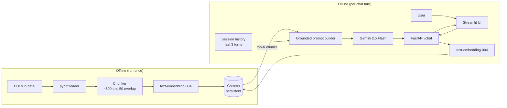
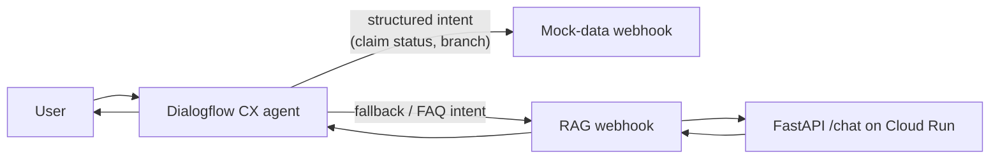

# Architecture

> _Filled in as each component lands. The skeleton below mirrors what we'll talk through in the interview._

## High-level diagram

## Layer 2 — Dialogflow CX in front

## Design decisions

_Each gets a paragraph of justification once the corresponding code lands._

- Chunk size and overlap
- Top-K
- Embedding + chat model choice
- Vector store choice (Chroma vs. alternatives)
- Similarity threshold and "I don't know" fallback
- Session memory window
- Why no re-ranker in Layer 1
- Why deterministic flows + RAG fallback (instead of a pure LLM agent)
